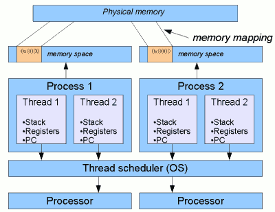

# Per-interpreter GIL for utilizing multiple cores within a single Python process

The repository is a small exercise of how one can use a newly introduced `Python` feature which is a `per-interpreter GIL`. 

The feature is an accepted solution for multi-core `Python`. It is already available through `Python/C API` starting from `Python` version `3.12`. 

If you value results and your time more than stories, please go right away to the section [Play with a per-interpreter GIL yourself](#playground) and see an example of `per-interpreter GIL` usage.

# Multi-core utilization

### Before we start, let's recall some technicalities

`Thread` and `Process` are two fundamental units of execution. Although both are related to how a computer executes tasks, they have different characteristics and serve different roles.

  
Figure 1. *Typical relationsip between
threads and processes* [[2]](#b2)

The `thread scheduler` is a fundamental part of modern operating systems and programming environments that manages the execution of threads in a multi-threaded application. Its primary responsibility is to allocate CPU time to different threads, ensuring fair execution and efficient utilization of system resources. Thread scheduling is crucial for achieving concurrency, responsiveness, and efficient use of hardware. [https://medium.com/@sadigrzazada20/the-thread-scheduler-4c40c6143009]

`Subinterpreter` ...

`Pipe` ...

### GIL slows down my application

While I was working on a task in one of the projects I struggle with a speed of loading the input data. 
It was taking several seconds because of **loading multiple files** with a table format data (excel/csv).

I tried to use **multi-threading** and load each file in a seperate thread. 
It gave a solid speed-up of the loading. Unfortunetly, python interpreter uses GIL[TODO link] mechanism (there are good reason for GIL existence, more about it later). "Thanks to GIL", only a single thread (main one or a child thread) can be running at a time, under most situations (when you are reading or writing from a file or socket the GIL is released allowing multiple threads to run in parallel). 

### Is there a way to release the GIL for pure functions using pure python?

In short, the answer is no, because those functions aren't pure on the level on which the GIL operates.[[9]](#b9)

```
def f(t):
    x = 16 * sin(t) ** 3
    y = 13 * cos(t) - 5 * cos(2*t) - 2 * cos(3*t) - cos(4*t)
    return (x, y)
```

```
>>> dis.dis(f)
  2           0 LOAD_CONST               1 (16)
              2 LOAD_GLOBAL              0 (sin)
              4 LOAD_FAST                0 (t)
              6 CALL_FUNCTION            1
              8 LOAD_CONST               2 (3)
             10 BINARY_POWER
             12 BINARY_MULTIPLY
             14 STORE_FAST               1 (x)
             ...
```
### Multi-processing as a way to do it

Since there are some CPU operations involved (loading data into memory as `pdtable` objects) 
I have tried to use multi-processing instead. The performance, when it comes to speed, was pretty the same as using multi-threading. This was because the main process needs to spawn itself multiple times and it 
takes some time. I have experienced a long spawning time while debugging in VSCode, on the regular run it is not so slow. But the argument of slow spawning reinforces the need of an another approach for a multi-core `Python`.

### We do not need multiple processes, basta!

But why do we even need to create a seperate process for such a pure function execution? We do not care about synchronization of any data here and we do not need to ensure thread-safe sharing of any state. We just want to run a function with a specific input and get the results back to the main thread (the one that is running the main `Python` interpreter). Shouldn't it be allowed to run on mutli-cores? I emphasize again, we do not care about any data/state synchronization. Probably it should, but for my knowledge, there is no such a thing in python yet ...

### Eureka! A Per-Interpreter GIL.

After some time I was reading about new features of `python` version `3.12` and I came across `PEP 684 – A Per-Interpreter GIL`[5]. 
Somebody, finally, creates an implementation of the real multi-core behaviour in `Python`. First version of `Python` was released in 1991. Even thought multiple cores processors started to be used on daily basis a bit later (The first commercial multicore processor architecture was Power 4 processor developed by IBM in 2001 [TODO source]), it is still a lot of time until such mechanism was introduced. It seems like there is a lot of work to be done 
since the whole architecture of python is not really supportive to the idea. The work already started and is ongoing for a few years with 
multiple PEP's with parts supporting the final implementation.

### What other programming languages can offer on the multi-core approach? 

`JavaScript`, similary as `Python`, is an interpreted language. One way to achieve concurrency in JavaScript is through the use of `Web Workers`, which are JavaScript scripts that run in the background and can perform tasks independently of the main thread. 

`Web Workers` (first published in 3 April 2009[[8]](#b8)) are more like `Python`'s multiprocessing in the sense that they both provide true concurrency for CPU-bound tasks by utilizing multiple cores. Web Workers create separate threads, while multiprocessing in Python creates separate processes.

Communication between threads in `Python` can be done through shared memory or thread-safe data structures, while `Web Workers` only communicate through message passing, which limits the potential for race conditions and makes state management simpler at the cost of being potentially less efficient for certain kinds of data exchange.

`C#` seems to have (according to my minimal knowledge of `C#`) a pretty solid library for a multi-core utilization called `TPL`. It was released 
together with version 4.0 of the .NET Framework (year 2010).


### Are there any real-life use cases for a per-Interpreter GIL?  

TODO ... https://peps.python.org/pep-0684/#motivation

Benchmark from the yt video [3] ...

### Are there any alternatives for utilizing multiple cores within a single Python process?

https://peps.python.org/pep-0684/#rationale

### What have we learned?

- `Python` PEPs can sometimes be very broad and require a lot of work.
- Initial decisions have a huge impact on the following features of a 
programming language (e.g. GIL).
- The full multi-core potential in `Python` is 
hard to achieve since the initial decision on 
the language behaviour. `GIL` is a simple solution for the thead-safety problems, but 
it is a blocker for utilizing multiple cores.
- `per-interpreter GIL` seems like a promising 
approach for multi-core ... But lets wait for 3.13 and a solid interface, together with 
external modules support.
- `Python` has a lot of cons, but a lot of of people still love it, mostly due to simplicity of writing programs in `Python`.

# <a name="playground"></a>Play with a per-interpreter GIL yourself

I have created a simple application with a GUI (using QT) in order to show an example of using `Subinterpreter` as an unit of execution. I strongly encourage you to playaround with the code.

There is already an implemention[1] of a Python interface for `interpreters` C API, but I found it too complex for my case (running a bunch of pure functions) and I have introduced the more briefly implementation ...

Sometimes using `per-interpreter GIL`, CPUs are not fully utilize and I can only guess that the reason is not good enough context switching. The same situation we encounter with `Web Workers` ...


## Environment
### Ubuntu

`sudo apt install python3-qtpy`

### Conda env

Firstly, install the `Conda` package manager if you do not have it yet: https://conda.io/projects/conda/en/latest/user-guide/install/index.html.

I am not a huge fan of a `Conda` package manager since it is really slow. Using `mamba`, a re-implementation of `Conda` make the `Conda` environemnts managing acceptable when it comes to timing of creating/updating python environments.

Installing `mamba` in your base conda environment let you reuse it every time you create a new `Conda` environment.

In order to create an environment, type the following commads:  

1. `conda install -c conda-forge mamba`  
2. `mamba env create -f environment.yml --prefix=<path_to_env_dir>`  

## Runner

# Bilbiography
<a name="b1"></a>[1] `Python interface for the "intepreters" C API`, https://github.com/jsbueno/extrainterpreters  

<a name="b2"></a>[2] Neil Coffey, `How threads work: more details`, https://www.javamex.com/tutorials/threads/how_threads_work.shtml

<a name="b3"></a>[3] Eric Snow, `A Per-Interpreter GIL: Concurrency and Parallelism with Subinterpreters`, https://www.youtube.com/watch?v=3ywZjnjeAO4  

<a name="b4"></a>[4] Eric Snow, `PEP 554 – Multiple Interpreters in the Stdlib`, https://peps.python.org/pep-0554/  

<a name="b5"></a>[5] Eric Snow, `PEP 684 – A Per-Interpreter GIL`, https://peps.python.org/pep-0684/  

<a name="b6"></a>[6] Microsoft, `TPL`, https://learn.microsoft.com/en-us/dotnet/standard/parallel-programming/task-parallel-library-tpl

<a name="b7"></a>[7] wikipedia, `Parallel Extensions`, https://en.wikipedia.org/wiki/Parallel_Extensions

<a name="b8"></a>[8] wikipedia, `Web worker`, https://en.wikipedia.org/wiki/Web_worker

[9] https://stackoverflow.com/a/65141099
