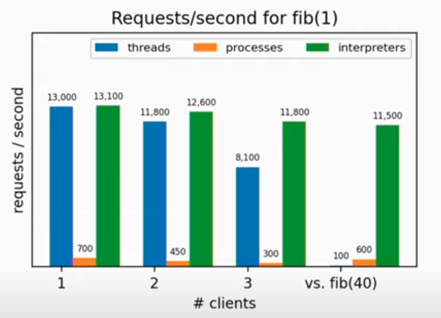

# Utilizing Multiple Cores in a Single Python Process with Per-interpreter GIL

## Intro

This repository presents a practical exploration of a relatively new feature in Python known as the Per-interpreter GIL[[1]](#b1). The Per-interpreter GIL enables the utilization of multiple cores within a single Python process.

This feature is accessible through the Python/C API starting from Python version 3.12<sup>[1](#f1)</sup>. A Pythonic interface for this feature is anticipated to be released with Python version 3.13 (coming out on October 2024).

Those eager to witness the Per-interpreter GIL in action can jump directly to the demo section titled [Play with Per-interpreter GIL yourself](#playground).

## Technicalities 

Before delving into the Per-interpreter GIL, it is beneficial to grasp the underlying concepts of threads and processes in the python context.


#### Threads vs. Processes: A Quick Summary*

**For a more detailed explanation, please see the [overview of Threads and Processes](#b2).*

Threads and Processes are two fundamental units of program execution. While both are integral to how a computer performs tasks, they possess distinct characteristics and fulfill different purposes. 

Threads: Lightweight units of execution that share the same memory space within a process, allowing for efficient task parallelism within a single application.

Processes: Independent units of execution, each with its own memory space, providing strong isolation but requiring more resources and complexity to communicate between them.

For a visual representation of how threads typically interact with processes, refer to *Figure 1* below.

  
Figure 1. *Typical relationsip between
threads and processes* [[2]](#b2)

Thread scheduler is a fundamental part of modern operating systems and programming environments that manages the execution of threads in a multi-threaded application. Its primary responsibility is to allocate CPU time to different threads, ensuring fair execution and efficient utilization of system resources. Thread scheduling is crucial for achieving concurrency, responsiveness, and efficient use of hardware[[3]](#b3).

#### What is a python interpreter?

Python is an interpreted language. Interpreted languages do not need to be compiled to run. A program called an interpreter processes Python code at runtime, or "on the fly." For a more in-depth explanation of interpreters, you might find the [Interpreter Wikipedia article](#b4) helpful.

#### What is GIL?

*The mechanism used by the CPython interpreter to assure that only one thread executes Python bytecode at a time. This simplifies the CPython implementation by making the object model (including critical built-in types such as dict) implicitly safe against concurrent access.*[[5]](#b5)

#### Does the GIL Only Slow Down Multi-threaded Programs, or Does It Have Benefits?


While the GIL can limit the execution speed of multi-threaded Python programs, it greatly simplifies development. For instance, performing operations on a shared dictionary across multiple threads will not lead to race conditions or data corruption. 

Furthermore, the GIL is released during I/O operations, such as reading or writing to a file or socket, which allows threads to run in parallel in these scenarios. The GIL is designed to facilitate multi-threading, and understanding its behavior can help developers write more efficient code.

#### Can We Disable the GIL for Executing Pure Python Functions?


<a name="shared_state"></a>Disabling the GIL to execute a set of pure Python functions across multiple threads might seem safe, especially if those functions do not appear to manipulate shared state explicitly. However, the CPython interpreter performs certain implicit actions that may affect shared state. For example, operations altering "reference counts" and "string interning" are two mechanisms that involve shared state.


#### What are Reference Counts?

In Python, every object has an associated reference count that the garbage collector utilizes to determine when its memory can be released. Creating, copying, or deleting any Python object impacts the reference count. These operations must be protected by the GIL because they alter the interpreter's global state. Without the GIL, concurrent reference count modifications by two threads on the same object could corrupt the count, leading to memory leaks or premature deallocation.

#### What is String interning?

For a comprehensive explanation of string interning, please refer to [this article](#b6).

Python optimizes memory usage by interning strings that are likely to be reused, particularly identifier strings. These strings include:

- Function and class names
- Variable names
- Argument names
- Dictionary keys
- Attribute names


Unsafe manipulations of shared cached objects and their reference counts can lead to critical errors. This is why extension modules, especially those that release the GIL, must handle reference counts and the lifecycle of Python objects with care. Let's consider the following Python code:


```python
from concurrent.futures import ThreadPoolExecutor
from dataclasses import dataclass
from functools import partial


@dataclass
class Person:
    first_name: str
    last_name: str

    @property
    def last_name_object_address(self) -> str:
        return hex(id(self.last_name))


def get_jackson_sibling(name: str) -> Person:
    return Person(
        first_name=name,
        last_name='Jackson'
    )

tasks = []

with ThreadPoolExecutor(2) as executor:
    for first_name in ['Michael', 'Freddy']:
        task = executor.submit(partial(get_jackson_sibling, first_name))
        tasks.append(task)
    
siblings = [task.result() for task in tasks]

for sibling in siblings:
    print(f'Hello {sibling.first_name}!')

if siblings[0].last_name_object_address == siblings[1].last_name_object_address:
    address = siblings[0].last_name_object_address
    print(f'Same memory address detected: {address}')
```

Output:

```
Hello Michael!
Hello Freddy!
Same memory address detected: 0x7fb1080be9f0
```

As demonstrated, Python sometimes reuses objects for efficiency reasons, such as with string interning, reducing memory usage.

  
Figure 1. *Demystifying CPython Shared Objects* [[7]](#b7)

#### Conclusion: Is it Safe to Disable the GIL for Pure Python Functions in Multi-threaded Execution?

No, it is not safe. Even if functions appear pure at the code level, they may not be pure in the context of the CPython interpreter, which involves shared state access during execution.

## Per-interpreter GIL

#### Bulding python objects using data from files

Let's consider a case with loading a specific input data. Loading takes several seconds because of sequantial reading of multiple files with a table format data (excel/csv).

Multi-threading improves the speed noticeably. Unfortunetly, due to GIL existence and some CPU operations involved, the loading is restricted to utilizing, not a full potential of multiple cores machine, but just a single core.

Switching to multi-processing seemed promising, but the performance gains are marginal compared to multi-threading. Spawning multiple processes, especially during debugging in VSCode, introduced significant overhead, although the impact was less pronounced during regular runs.

#### The Case for Single-Process, Multi-Core Execution

Why do we need to create a separate process for executing what appears to be pure functions? Ideally, such functions should be able to run on multiple cores without explicitly shared data or state synchronization. However, as previously discussed [here](#shared_state), this is not feasible due to the shared state implicitly managed by the Python interpreter.

#### The Advent of Per-Interpreter GIL

Among the all new features of Python 3.12 we can find [PEP 684 – A Per-Interpreter GIL](#ref-to-PEP-684). A real possibility for multi-core execution within Python was introduced.

Although Python's first release was in 1991, and multicore processors became more common in the following decade (with IBM's POWER4 processor in 2001 serving as a notable example[[8]](#b8)), true multi-core support in Python has been elusive.

With ongoing efforts and multiple supporting PEPs, Python 3.12 has finally brought us closer to this goal through the Python/C API that allows experimentation with this new approach to multi-core processing.

#### Real-Life Applications of Per-Interpreter GIL

The motivation for introducing the per-interpreter GIL, and the benefits it provides, are outlined in detail [here on PEP 684](https://peps.python.org/pep-0684/#motivation).

Consider, for instance, a server tasked with handling complex requests where each request involves numerous computationally intensive operations that could be parallelized. Instead of spawning a separate process for each operation, which introduce considerable communication overhead, the Per-interpreter GIL could optimize performance by reducing this overhead.

Eric Snow presented an informative benchmark at PyCon US 2023[[9]](#b9), showcasing the potential of the per-interpreter GIL. For a comprehensive review, watching the full presentation is recommended.

Summary of the Presentation:
Eric Snow presented significant performance improvements under the per-interpreter GIL architecture.

  
Figure 3. *Comparison between clients based on thread, process and Per-interpreter GIL.*

Note: Some results presented (as the one presented on the Figure 3) may seem extraordinarily favorable and warrant further investigation to fully understand their implications.


#### Alternatives for Multi-core Utilization in a Single Python Process

For a discussion of alternative methods for leveraging multiple cores within a single Python process, refer to the rationale section of [PEP 684](https://peps.python.org/pep-0684/#rationale).

#### What have we learned?

- Python Enhancement Proposals (PEPs) happens to be broad in scope and entail significant development effort.
- Early design decisions can considerably influence future features and limitations of a programming language's implementation, as illustrated by the role of the GIL in CPython.
- Achieving the full potential of multi-core processing in Python is challenging due to original language design choices. While the GIL offers a straightforward solution for thread safety, it also impedes the full utilization of multi-core architectures.
- The Per-interpreter GIL presents a promising avenue for better multi-core utilization within Python. However, the true benefits and wider adoption await the release of Python 3.13, which promises a user-friendly Python interface. It is anticipated that support for external modules will mature as experiences are gathered and shared.
- Despite its drawbacks, Python remains a widely favored language, largely due to its simplicity and the speed of development. It offers huge flexibility and continues to be an excellent language for prototyping.

## <a name="playground"></a>Play with a Per-interpreter GIL yourself

A simple QT-based GUI application is provided in this repository to demonstrate using the subinterpreter (thread running a seperate interpreter) as a unit of execution. You are encouraged to explore and experiment with the example code.

An implementation of a Python interface for the interpreters C API already exists[[10]](#b10), but it was more complex than necessary for implementing the example (the example just executes a set of pure functions). Therefore, a more streamlined version has been crafted for the purpose of this article.

### Environment preparation
#### Install pyqt on Debian-Based Linux Distributions

To install PyQt, run the following command:  

`sudo apt install python3-qtpy`

#### Create Conda env

If you haven't installed Conda yet, follow the instructions here: [Install Conda](https://conda.io/projects/conda/en/latest/user-guide/install/index.html).

While Conda can sometimes be slow, using mamba—a fast re-implementation of Conda—can help speed up environment management tasks.

After installing Conda, you can install mamba in your base Conda environment to reuse it whenever creating new environments:

`conda install -c conda-forge mamba`

In order to create an environment, type the following commad:

`mamba env create -f environment.yml --prefix=<path_to_env_dir>`  

### A `Per-interpreter` runner<sup>[2](#f2)</sup>

To run the sample application using Per-interpreter GIL, activate the environment: 

`conda activate <path_to_env_dir>`    

and start the application:

`python main_qt.py`

One can face an issue with loading the QT plugins. To solve that, please set the 
following environmental variable before running the Python script:

`QT_PLUGIN_PATH=<path_to_env_dir>\Lib\site-packages\PyQt5\Qt5\plugins`

The application allows performance comparison among three types of workers:
1. Thread-based
2. Process-based
3. Subinterpreter-based (thread-based utilizing Per-interpreter GIL)

For a deeper dive into how the subinterpreter-based runner is implemented, visit the [subinterpreters module](runner/subinterpreters.py). To test different functions than just generating a figonacci sequence, modify the [callables module](job/callables.py).

### [EXTRA] JS Web-workers runner<sup>[2](#f2)</sup>

JavaScript, much like Python, is an interpreted language. In JavaScript, concurrency can be achieved using Web Workers. These are scripts that run in the background and operate independently of the main execution thread.

Introduced on April 3, 2009[[11]](#b11), Web Workers offer true concurrency for CPU-bound tasks by utilizing multiple cores. Each worker runs in a separate thread while staying within a single process.

Python allows threads to communicate using shared memory or thread-safe structures. In contrast, Web Workers rely solely on message passing for communication, reducing the risk of race conditions and simplifying state management but potentially less efficient for specific types of data interchange.

To assess JavaScript's Web Workers performance on the same task we did we Python, follow these steps:

`cd js-web-workers`  
`python -m http.server`  

Then navigate to `http://0.0.0.0:8000/` in your web browser. 

Message passing in Web Workers offers intuitive and safe communication between threads. On top of that, the example clearly shows how much JS is better than python when it comes to computations performance. One should not be suprised why her browser is mining crypto on some web-pages. From the parasite perspective, mining is free and pretty efficient at the same time. BTW. There are strong indications that crypto mining is a waste of energy. One should consider to spent her (or others) resources in more useful way.

### [EXTRA] C# Task Parallel Library (TPL) Runner

In the realm of .NET, the Task Parallel Library (TPL)[[12]](#b12) provides a robust framework for multi-core processing, released with version 4.0 of the .NET Framework in 2010.

Ensure you have the .NET environment installed to run the C# example:

`cd DotNetTPL`  
`dotnet run Program.cs`

The author experience in C# is so limited that a junior C# developer might suggest it is non-existent. Therefore, acknowledgment is due to ChatGPT for its assistance in creating this example. The example is the same performance test as we did with Python and JS. BlockingCollection has been used as a communication mechanism between the main thread and workers threads.

# Footnotes

<a name="f1"></a>*1. Compatibility with extension modules remains an area for further development under the per-interpreter GIL approach. For instance, importing popular libraries such as numpy into subinterpreters has demonstrated some challenges, which may require additional investigation or workarounds.*  

<a name="f2"></a>*2. Observations on a machine running Ubuntu indicate that CPUs sometimes are not be fully utilized when employing the per-interpreter GIL or JavaScript Web Workers. This underutilization might be related to context switching efficiency or thread scheduler behavior.*

# Bilbiography
<a name="b1"></a>[1] Eric Snow, `PEP 684 – A Per-Interpreter GIL`, https://peps.python.org/pep-0684/  

<a name="b2"></a>[2] Neil Coffey, `How threads work: more details`, https://www.javamex.com/tutorials/threads/how_threads_work.shtml

<a name="b3"></a> [3] Sadigrzazada, `The thread scheduler`, https://medium.com/@sadigrzazada20/the-thread-scheduler-4c40c6143009

<a name="b4"></a> [4] wikipedia, `Interpreter (computing)`, https://en.wikipedia.org/wiki/Interpreter_(computing)

<a name="b5"></a> [5] python.org, `Global Interpreter Lock`, https://docs.python.org/3/glossary.html#term-global-interpreter-lock

<a name="b6"></a> [6] Brennan D Baraban, `String Interning`, https://medium.com/@bdov_/https-medium-com-bdov-python-objects-part-iii-string-interning-625d3c7319de

<a name="b7"></a>[7] Brennan D Baraban, `Demystifying CPython Shared Objects`, https://medium.com/@bdov_/https-medium-com-bdov-python-objects-part-ii-demystifying-cpython-shared-objects-fce1ec86dd63

<a name="b8"></a>[8] wikipedia, `POWER4`, https://en.wikipedia.org/wiki/POWER4

<a name="b9"></a>[9] Eric Snow, `A Per-Interpreter GIL: Concurrency and Parallelism with Subinterpreters`, https://www.youtube.com/watch?v=3ywZjnjeAO4

<a name="b10"></a>[10] `Python interface for the "intepreters" C API`, https://github.com/jsbueno/extrainterpreters  

<a name="b11"></a>[11] wikipedia, `Web worker`, https://en.wikipedia.org/wiki/Web_worker

<a name="b12"></a>[12] Microsoft, `TPL`, https://learn.microsoft.com/en-us/dotnet/standard/parallel-programming/task-parallel-library-tpl
